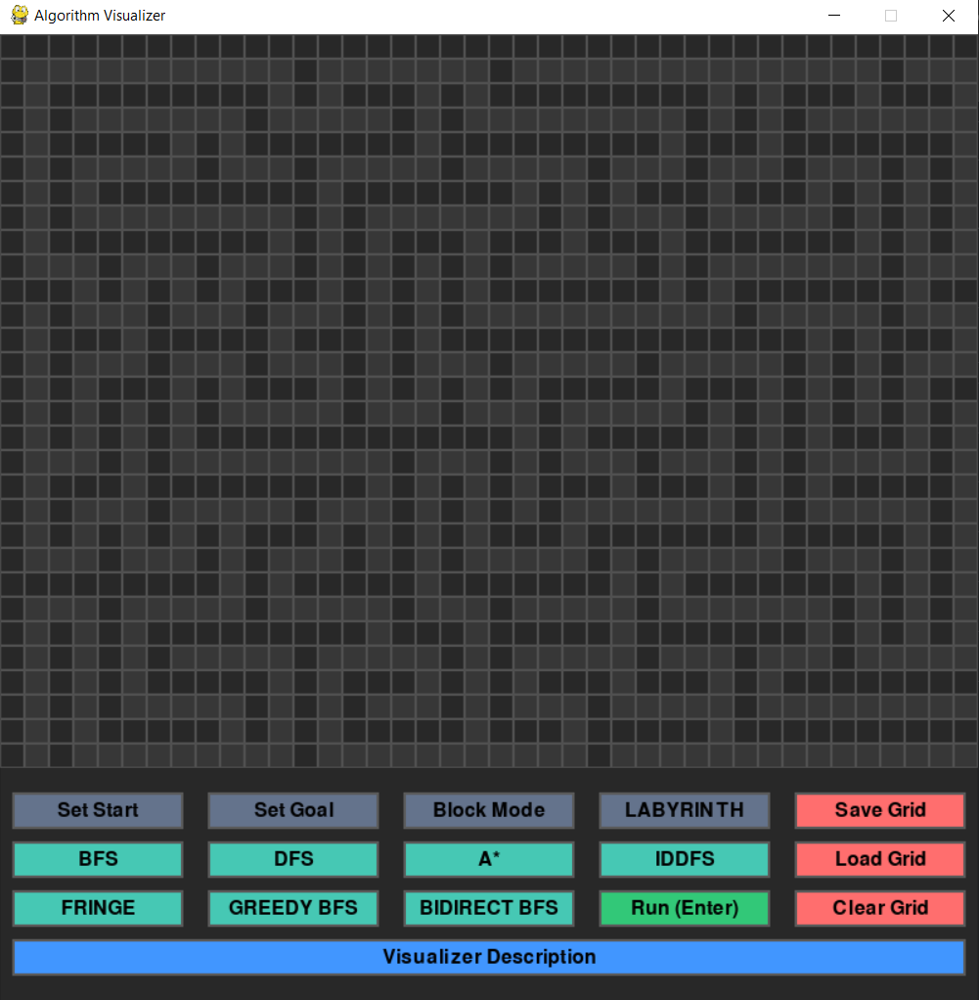
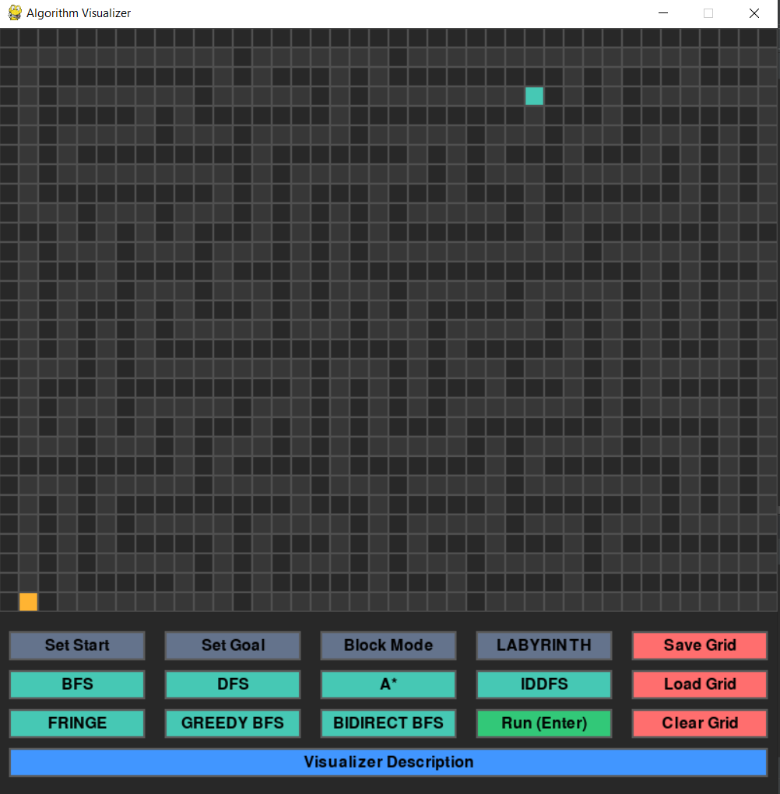
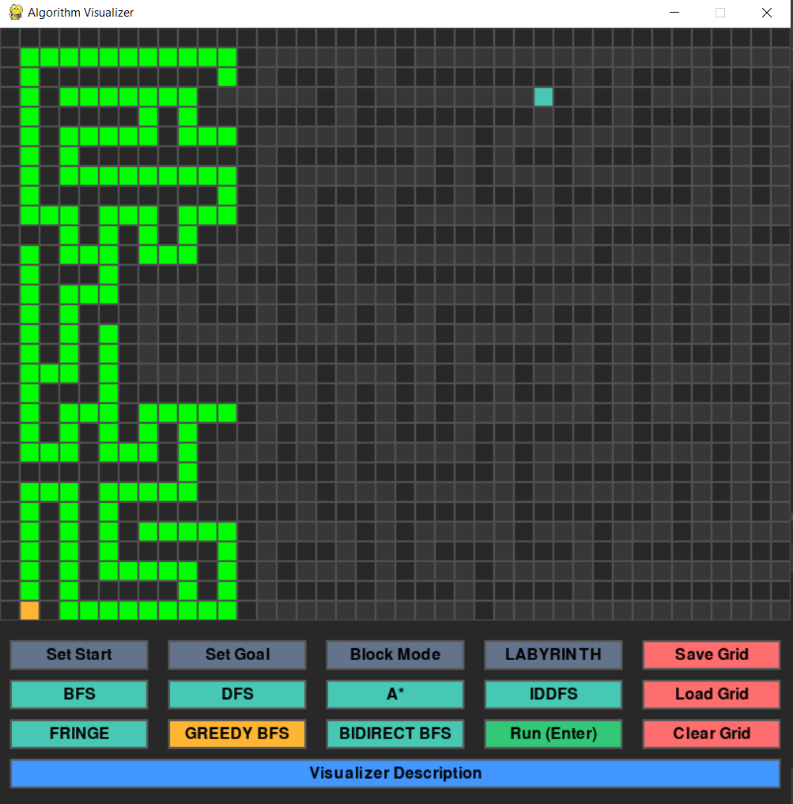
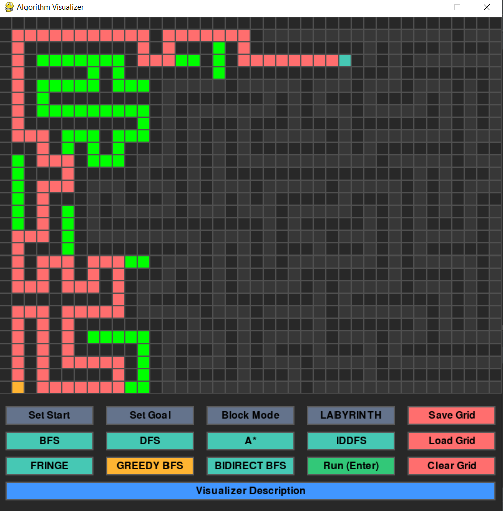

# Graph Algorithm Visualization Suite

A sophisticated algorithm visualization platform that demonstrates fundamental graph traversal and pathfinding techniques through interactive visual simulations. 
This Python implementation provides precise, step-by-step visualization of 7 core graph traversal algorithms with customizable execution parameters. 
Designed for computer science education and algorithmic analysis, the tool highlights each algorithm's unique node exploration patterns, frontier behavior, and path derivation logic. 
The visualization contrasts algorithmic approaches to reveal their relative efficiencies in solving identical graph problems. 
Professional-grade features include weighted edge support, heuristic customization for informed searches, and comprehensive performance metrics.

  <table>
    <tr>
      <td>
        
      </td>
      <td>
        
      </td>
    </tr>
    <tr>
      <td colspan="2" align="center">
        <b>Grid-based Pathfinding Visualizer</b>
      </td>
    </tr>
  </table>

## Features

- Interactive grid with dynamic visualization
- Maze generator for testing algorithms
- Heuristic functions support for informed search (e.g., Manhattan, Euclidean)
- Save and load grid configurations using JSON
- Real-time animation of traversal steps
- Support for multiple search algorithms
- Performance report: time needed to find goal node and path cost
- Intuitive and user-friendly control panel

## Screenshots

<table align="center">
  <tr>
    <td align="center">
       
    </td>
    <td align="center">
       
    </td>
    <td align="center">
       
    </td>
  </tr>
  <tr>
    <td align="center">
       
    </td>
    <td align="center">
       
    </td>
    <td align="center">
       
    </td>
  </tr>
  <tr>
    <td align="center">
       
    </td>
    <td align="center">
       
    </td>
    <td align="center">
       
    </td>
  </tr>
</table>

## Supported Algorithms
- **Breadth-First Search ( BFS )**
- **Depth-First Search ( DFS )**
- **A***
- **Iterative Deepening Depth-First Search ( IDDFS )**
- **Fringe algorithm ( Memory efficient A*** **)**
- **Greedy Best-First Search ( Greedy BFS )**
- **Bidirectional Breadth-First Search ( Bidirect BFS )**

## Technologies Used

This project combines core Python features and libraries to deliver a modular, interactive pathfinding algorithm visualizer:

- **Python 3** – The foundation of the application, leveraging its flexibility and strong support for scripting, data manipulation, and event-driven design.
- **Pygame** – Handles rendering the visual grid, detecting mouse and keyboard input, and animating algorithm steps in real-time.
- **Generators & `yield`** –  Used to implement non-blocking, step-by-step algorithm animation. When an algorithm yields a step (such as visiting a tile), the control is returned to the main loop so the screen can update and user events can be processed.  
  Under the hood, generators create **iterator objects**, which pause execution at each `yield` and resume from that point upon the next call. 
- **JSON** –  A critical part of the system, JSON is used to:
  - Save the current grid state (walls, start, goal, etc.) as a structured text file.
  - Load previously saved configurations to restore the visualizer’s exact state.
  - Make the data portable, editable, and human-readable — making it easier to test different scenarios or share setups.
  - Enable future extensions (e.g., import/export between apps or web clients).
- **Object-Oriented Design** – The codebase is cleanly separated into classes that represent the grid, tiles, buttons, algorithms, and visual logic. This improves readability and maintainability.
- **Custom UI System** – All interface components like buttons, labels, and toggles are manually implemented using Pygame primitives, providing full control over layout, style, and interactivity.

## UI Components

The visual interface of the **Graph Traversal Visualizer** is designed for intuitive interaction and easy algorithm experimentation. Here's a breakdown of the main UI components:

### Grid Area
- A large central grid represents the graph space.
- Nodes can be marked as:
  - **Start Node**
  - **Goal Node**
  - **Blocked Cells** (walls)
- The grid visually updates as the algorithm progresses.

### Control Panel

#### Node Placement
- `Set Start` – Choose the starting point for the algorithm.
- `Set Goal` – Set the destination node.
- `Block Mode` – Toggle cells to become obstacles (walls).

#### Labyrinth Options
- `LABYRINTH` – Automatically generate a random labyrinth layout for testing.

#### Grid Management
- `Save Grid` – Save the current grid configuration to a file.
- `Load Grid` – Load a previously saved configuration.
- `Clear Grid` – Reset the grid to a blank state.

#### Algorithm Buttons
- Run one of the following graph traversal algorithms:
  - `BFS` – Breadth-First Search
  - `DFS` – Depth-First Search
  - `A*` – A-Star Search
  - `IDDFS` – Iterative Deepening DFS
  - `FRINGE` – Fringe Search
  - `GREEDY BFS` – Greedy Best-First Search
  - `BIDIRECT BFS` – Bidirectional BFS
- `Run (Enter)` – Execute the selected algorithm.

#### Description Panel
- `Visualizer Description` (bottom bar) – Placeholder area for displaying contextual descriptions, algorithm info, or live feedback.

## How to Use the Visualizer

<table align="center">
  <tr>
    <td align="center">
      <figure>
        
        <figcaption><b>Start Visualizer</b></figcaption>
      </figure>
    </td>
    <td align="center">
      <figure>
        
        <figcaption><b>Select Start and Goal Tile</b></figcaption>
      </figure>
    </td>
  </tr>
  <tr>
    <td align="center">
      <figure>
        
        <figcaption><b>Select Algorithm and Click Run</b></figcaption>
      </figure>
    </td>
    <td align="center">
      <figure>
        
        <figcaption><b>Algorithm Execution Finished</b></figcaption>
      </figure>
    </td>
  </tr>
</table>

1. **Select Start and Goal Nodes**
   - Click `Set Start`, then click a cell on the grid.
   - Click `Set Goal`, then choose a destination cell.

2. **Add Obstacles (Optional)**
   - Click `Block Mode` to toggle walls on the grid by clicking cells.

3. **Add weighted edges (Optional)**
   - Hold CTRL on keyboard, then click a cell on the grid.
   - Weighted edges cost 5, default is 1

4. **Generate a Maze (Optional)**
   - Press `LABYRINTH` to auto-generate a challenging maze.

5. **Pick an Algorithm**
   - Click on any of the algorithm buttons (e.g., `BFS`, `A*`, etc.).

6. **Run the Algorithm**
   - Click `Run (Enter)` to visualize the selected algorithm in real-time.

7. **Grid Controls**
   - `Save Grid` – Save the current state.
   - `Load Grid` – Reload a previously saved grid.
   - `Clear Grid` – Reset the grid.

## Roadmap
- Add support for diagonal movement
- Export path as sequence of coordinates
- Add Dijkstra’s and other algorithms
- Web-based version with same UI/logic

## Conclusion

The Graph Algorithm Visualization Suite serves as both an educational tool and a development framework for understanding graph traversal and pathfinding strategies. By offering real-time visual feedback, configurable heuristics, and interactive controls, it provides a hands-on learning experience for students, educators, and developers alike.

## License

MIT License. See the [LICENSE](LICENSE) file for full details.

